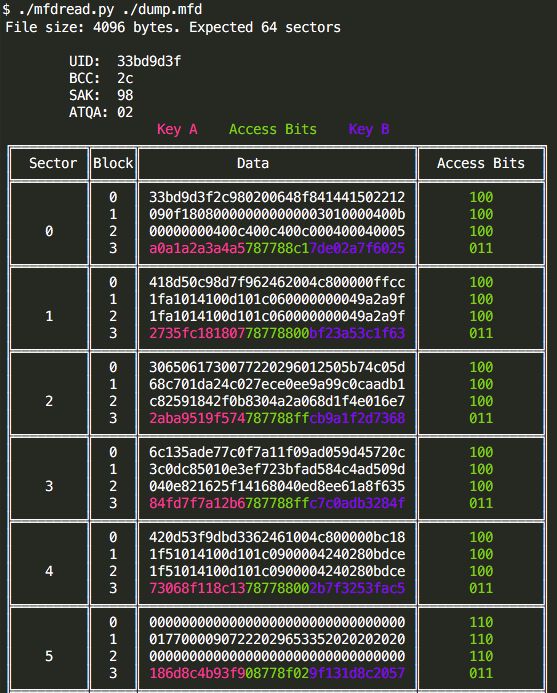

# Gachapon

## Scenario

The challenge setup:

- You are given a Grey NFC card (specifically MIFARE CLASSIC 1K)
- The card does not have sufficient balance to buy a gachapon
- The objective is to understand how the device checks the card balance, then modify or bypass the check in the challenge environment to trigger a successful prize release

Expected behavior:

- Success: the card is accepted and the servo moves to unlock or release the gachapon
- Failure: the card is rejected and the servo does not move

## Hardware Used

- ESP32-C3 microcontroller
  - A small computer that runs the device firmware
- NFC reader
  - Reads data stored on the NFC card
- Servo motor
  - Moves the lock or release mechanism for the gachapon

## Terminology

- Flash
  - Non-volatile storage memory used by the ESP chip to store firmware and data.
  - It keeps data even when the device is powered off
- Firmware
  - Software that runs on hardware
  - In this case, it is the program running on the ESP chip
- Baud
  - Serial communication speed between the PC and the ESP chip
  - Common values are `115200`, `460800`, and `921600`
- Flashing firmware
  - Writing firmware to the device storage memory
- Dumping or extracting firmware
  - Reading firmware from the device storage memory into a file

## Challenge Files

> This part is done fully statically, no dynamic analysis required!

- `checker.ino` is the <u>source code version</u> of the firmware that was flashed onto the hardware
  - Focus on this if you are new to cyber
- `checker.ino.elf` is the <u>compiled version</u> of the firmware that was flashed onto the hardware
  - Look at this if you are have experience with IDA
  - Or if want to learn how to reverse engineer firmware!
    - Reference `checker.ino` if you are stuck :)

## Note

- ONCE YOU FIGURE OUT WHERE TO MODIFY THE BALANCE AND CHECKSUM VALIDATION IN THE NFC CARD, PLEASE INFORM US!
- WE WILL PROVIDE YOU WITH A PROXMARK/FLIPPER TO MODIFY THE DATA ON THE NFC CARD :)
- https://docs.flipper.net/zero/nfc/read
- https://docs.flipper.net/zero/qflipper

## Tips

- Hardware code follows this structure:

  ```c
  setup() {
  	// some initialization ...
  }
  
  loop() {
  	// continuous code that keeps running
  	// main logic is here!
  }
  ```

- Firmware may be large, so consider filtering location of useful code via <u>strings</u>!

  - `Shift + F12` in IDA -> `Ctrl + F` for 'NFC'

- Understand NFC concepts

  - **MIFARE Classic 1K has 1024 bytes, split into 16 sectors, each sector has 4 blocks, and each block is 16 bytes**

    ```
    Sector 0
        Block 0  Manufacturer block / UID area, do not overwrite
        Block 1  Data block, 16 bytes
        Block 2  Data block, 16 bytes
        Block 3  Sector trailer: keys + access bits
    
      Sector 1
      Block 4  Data block
        Block 5  Data block
        Block 6  Data block
        Block 7  Sector trailer
    
      ...
    ```

  - A “key” is a **6-byte password** used to unlock a sector before reading/writing it

    - card allows read/write depending on access bits
    - default key is { 0xFF, 0xFF, 0xFF, 0xFF, 0xFF, 0xFF }
    
    

    *image taken from https://github.com/smolinde/nfc-tutorial
    
  - Tips

    - authenticate sector first
    - read/write in 16-byte blocks
    - avoid block 0
    - avoid sector trailer blocks unless changing keys/access
